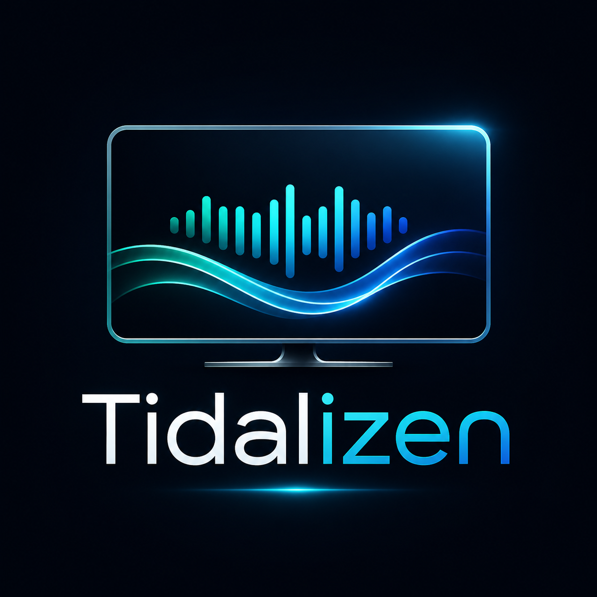

# Tidalizen

**Tidalizen** is a native Samsung Tizen WGT music client for TIDAL-style playback flows. It is built as a real TV app, not a TizenBrew overlay: the app has its own `config.xml`, launcher icon, TV remote focus engine, AVPlay playback adapter, TIDAL OAuth/API adapter, diagnostics overlay, and GitHub Actions WGT build pipeline.



## What is included

- Production Tizen web-app structure under `app/`.
- Samsung TV remote navigation: arrows, OK, Back/Return, media keys, colored diagnostic keys.
- TIDAL SDK-aligned auth/API layer:
  - limited-input/device login flow when your TIDAL client is allowed to use it;
  - manual access-token import for development and debugging;
  - session, search, favorites, and track-manifest calls.
- AVPlay playback layer:
  - DASH manifest handling;
  - PlayReady/Widevine event bridge;
  - HTML5 audio fallback for desktop/dev and direct non-DRM URLs.
- Full on-screen diagnostics, with token/secret redaction.
- WGT build pipeline based on the working AirTizen/Jellyfin Tizen CI pattern:
  - Tizen Studio Web CLI install;
  - certificate profile creation/import;
  - Jellyfin-style `profiles.xml` password patching;
  - fixed `expect` password prompt handling;
  - strict artifact upload;
  - unsigned ZIP WGT fallback only if official signed packaging fails.

## Hard truth about credentials

This repository does **not** ship private TIDAL production credentials and does **not** bypass TIDAL DRM, account, subscription, or licensing controls.

To use the live TIDAL API/playback path you need a valid TIDAL developer/client setup. The official TIDAL Web SDK documentation states that device login is currently only available for internally developed TIDAL applications. Tidalizen therefore supports it as an integration path, but the client ID you enter must be allowed by TIDAL.

For TV installation, use a Samsung/Tizen certificate that is valid for your target TV. The CI fallback WGT is useful for artifact generation, but physical TV installation may require a Samsung certificate and install permit.

## Local repo checks

```bash
npm run verify
npm run package:zip
```

`npm run package:zip` creates `app/release/Tidalizen.wgt` without Tizen Studio. This is useful for fast structural checks. For signed Samsung TV builds, use the GitHub Actions workflow or Tizen Studio CLI.

## GitHub Actions release

Push a tag to build and publish a WGT artifact:

```bash
git tag -f 1.0.0
git push -f origin 1.0.0
```

## Install to a TV

```bash
scripts/install-to-tv.sh 192.168.1.50 app/release/Tidalizen.wgt
```

## App setup on TV

1. Open **Settings** inside Tidalizen.
2. Enter your TIDAL `clientId`.
3. Optional: enter `clientSecret` only if your integration requires it and you accept storing it locally on the TV.
4. Use **Device Login** if your client supports it, or paste/import an access token for development.
5. Use **Search** or **Favorites**.
6. Press the blue key for full diagnostics.

## Source influences

- `tidalbrew` upload: UI/diagnostic and AVPlay target behavior were used as design input, but this repo is structured as a native WGT instead of relying on a TizenBrew local Node service.
- `tidal-sdk-web` upload: auth/API flow names and official limitations were used to align the adapter.
- `sone` upload: TV music-client UX ideas, caching/normalization direction, and TIDAL-oriented data modeling were used as design input.
- Jellyfin Tizen CI: the `profiles.xml` signing-password patch pattern was adapted for stable headless WGT builds.
